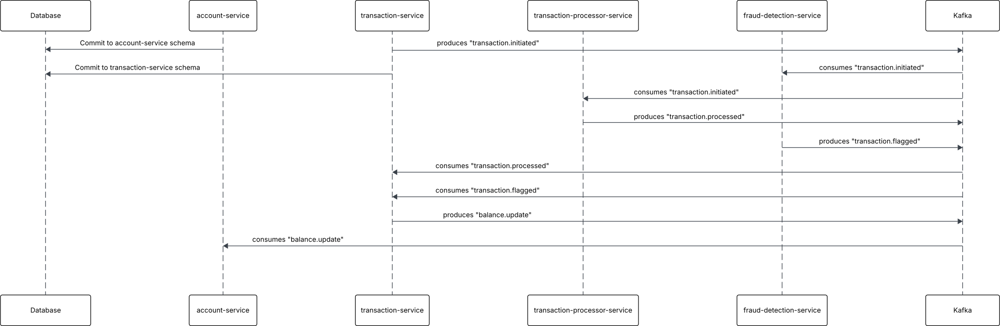

# Event-Driven Microservices for Transaction Processing

A microservices system simulating a financial transaction platform using Apache Kafka, Avro, Docker, and
Spring Boot. This architecture showcases modern patterns such as asynchronous messaging, schema-based communication, and
service decoupling.

---

## Microservices Overview

| Service                   | Responsibility                                                   |
|---------------------------|------------------------------------------------------------------|
| **Account Service**       | Owns and manages account data and balance updates.               |
| **Transaction Service**   | Handles transaction creation, orchestrates Kafka events.         |
| **Transaction Processor** | Applies business rules to transactions (e.g., approval/decline). |
| **Fraud Detection**       | Flags transactions suspected to be fraudulent.                   |

All services communicate via **Kafka topics**, using **Avro-encoded messages** for structured, version-safe payloads.

---

## Event Flow

1. **Transaction Created**
   `TransactionService` commits to DB and produces `transaction.initiated`.

2. **Parallel Consumption**
   `TransactionProcessorService` and `FraudDetectionService` consume the event concurrently.

3. **Processing Results**

    * `TransactionProcessorService` produces `transaction.processed`
    * `FraudDetectionService` produces `transaction.flagged`

4. **Status Updates**
   `TransactionService` consumes both events and updates the transaction status accordingly.

5. **Balance Update**
   `TransactionService` produces `balance.update` for valid transactions.

6. **Final Commit**
   `AccountService` consumes the event and updates the account balance.

<a href="./images/transactions-project-sqeuence.svg" target="_blank">
  
</a>

---

## Technical Stack

* **Language**: Java 17
* **Framework**: Spring Boot (multi-module via Gradle)
* **Messaging**: Apache Kafka with Avro serialization
* **Database**: PostgreSQL (separate schema per for Account Service & Transaction Service)
* **Documentation**: Springdoc OpenAPI (Swagger UI)
* **Communication**: Kafka & Feign clients (for internal REST)

---

## Kafka Topics

* `transaction.initiated`
* `transaction.processed`
* `transaction.flagged`
* `balance.update`

---

## Avro & Schema Registry

* Each Kafka message uses a dedicated **Avro schema**.
* Managed centrally with **Confluent Schema Registry**.
* Ensures **backward compatibility** and schema evolution.

---

## Dockerized Infrastructure

| Component           | Description                                 |
|---------------------|---------------------------------------------|
| **Kafka**           | Core message broker                         |
| **Zookeeper**       | Required by Kafka for coordination          |
| **Schema Registry** | Manages Avro schemas                        |
| **Kafdrop**         | UI for inspecting Kafka topics and messages |
| **PostgreSQL**      | Persistent storage per service schema       |

All of the above are configured in Docker Compose for local development.

---

## Swagger Documentation

All APIs are documented using **Springdoc OpenAPI 3**.

Access each service’s Swagger UI at:

```
http://localhost:{PORT}/swagger-ui/index.html
```

---

## Project Structure

```
root-project/
├── account-service/
├── transaction-service/
├── transaction-processor-service/
├── fraud-detection-service/
├── common-avro-schemas/
├── shared-library/
├── docker-compose.yml
└── README.md
```

Each service is a self-contained Spring Boot module built with Gradle, wired via Kafka.

---

## Notes

* The system supports **parallel, independent message processing**.
* Custom repository methods are used to cross-reference transaction and account IDs.
* Feign clients facilitate inter-service communication without tight coupling.
* The project is structured as a **multi-module Gradle build**.
* Kafka infrastructure includes **Zookeeper** and **Schema Registry**.

---

## Areas for Improvement

This project is a work in progress with several improvements under consideration:

* **Replace Feign Clients:**
    * Evaluate replacing Feign with asynchronous messaging or gRPC to reduce service coupling and improve resiliency.

* **Introduce Comprehensive Testing**
    * Future versions will include unit tests, integration tests, and contract testing using tools like Testcontainers
      and Pact.

* **Replace Internal Controllers with K6 Load Testing**
    * Eliminate ad hoc controller endpoints and rely on K6 scripts for performance and stress testing.

* **General Refactoring**
    * Clean up redundant or unused code, improve DTO-layer consistency, and streamline internal service
      responsibilities.

* **Include PostgreSQL in Docker Compose**
    * potentially package PostgreSQL with the kafka related containers; option to automate schema setup using mounted
      scripts or init containers.

* **Retry & DLQ Handling for Kafka**
    * Add retry strategies and dead-letter queues for robust event consumption, especially under transient failure.

* **Monitoring and Observability**
    * Add Prometheus and Grafana for metrics, along with distributed tracing (e.g., OpenTelemetry or Zipkin).

* **Centralized Logging**
    * Consider ELK stack (Elasticsearch, Logstash, Kibana) or Grafana Loki for unified log storage and search.

---

> This project serves as a foundation for learning distributed system design, event-driven architecture, and real-world
> backend engineering practices. Improvements, and refactoring ideas are welcome.
